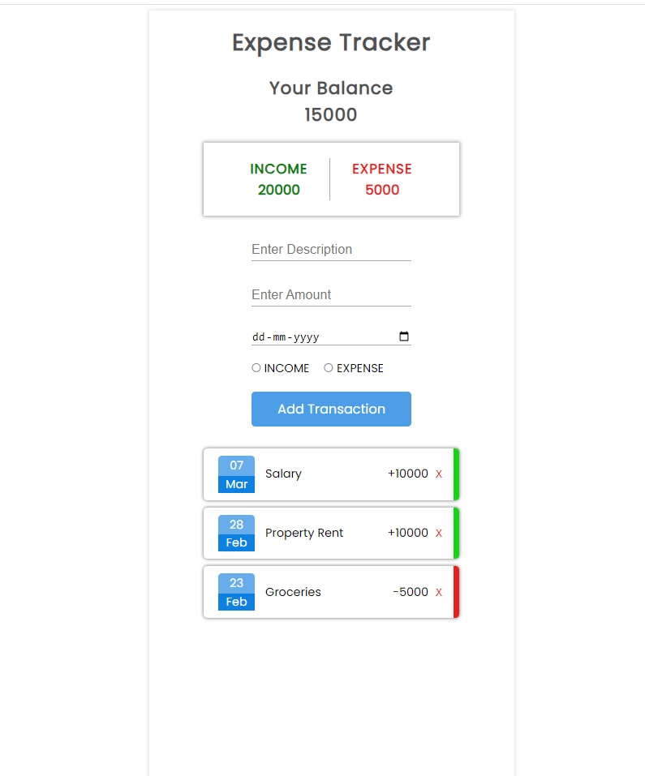

### Expense Tracker App

### Problem Requirements
Write an application to track your expenses/income. These are the functionalities you need to implement in your application:

1. The application is divide into 4 parts - Header, Summary, UserForm, TransactionList
    - Header Should contain the Heading of the application as `Expense Tracker` and also should display the Total Balance.
    - Summary should display the Total Income & Total Expense Amount.
    - UserForm should have 2 text fields - `Description` & `Amount`, a date field, 2 radio buttons - `Income` & `Expense` and a button with text `Add Transaction`.
    - TransactionList should have the list of transactions for which you should use `UL`.
2. User should be able to add personal expenses or income. Expense/Income record should include id, description, category, transactiondate, amount. Use a model class with properties - `id`, `description`, `category`, `transactiondate`, `amount`.
3. In TransactionList 
    - Each list item should display date of transaction, description & amount.
    - Each list item should have a button on the right to delete the transaction.
    - In each item there should be colour coding for the right border. For income & expense transaction it should display green and red colour border respectively.
    - In each item there should be +/- sign with amount based upon the type of transaction.
4. Upon adding or removing the transaction, the amount should be reflected in header & summary.
5. All data should be stored in `db.json` file.
6. Use font awesome icons wherever required.
7. Use bootstrap to style your application.
8. UserForm should have proper validations.
9. Formik & yup should be used for form handling.

### Screenshot

