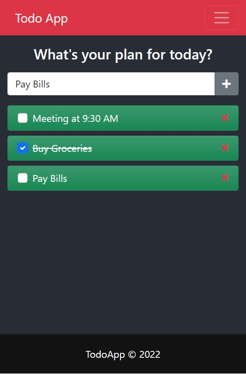

### Assignment Case Study
Building a Task Management Application using React.js

### Objective:
To create a Task Management Application using React.js, focusing on the implementation of components, styling, state management, props, and hooks.

### Scenario:
You have been hired by a startup to develop a task management application. The application should allow users to create, edit, and delete tasks. Each task should have an id, text, and isCompleted property.

### Components
Create the following components:
- App: The main component that renders other components and manages application-level state.
- TodoList: Renders a list of tasks.
- TodoItem: Renders individual task items.
- TodoForm: Renders a form for creating/editing tasks.

### Important Instructions
- You can use state and props but cannot use context API or Redux for managing state.
- All data needs to be persisted in json-server

### Screenshot

