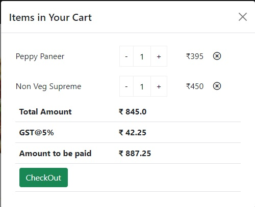

## HotPizza

### Problem Statement
HotPizza is an American restaurant chain and international franchise founded in 2018 in Boston USA. It provides Italian-American cuisine, including pizza, pasta, side dishes and desserts. It has many restaurants worldwide, making it the popular pizza chain in terms of variety and quality. To reach out more customers they have decided to start online sales of pizza and cuisines.

As a web developer you are assigned a task to design frontend of the application which includes the landing page and Cart.

The application should have following functionalities
1. The application should have navbar on the top. On the left side of navbar it should display the brand logo with brand name. On the right side of navbar it should have Cart icon with badge that should display the current number of items in the cart.
2. The landing page should display different products like pizza, side dishes, pasta etc. (Use the images available in boilerplate) in card format which should also include the price and `Add to Cart` button.
3. When user click on `Add to Cart` button it should add the item in cart and display the confirmation message as `Item added to cart`. Also it should increment the value of the cart items in the badge of Cart icon.
4. When user click on Cart icon it should navigate to cart page and display the items added in the Cart. If there are no items in the cart then it should display Empty Cart message.
5. On the cart there should be an option to increase or decrease the quantity of the item. Minimum quantity can be 1 and maximum should be 10. Also the user should be able to remove the item from cart.
6. Upon incrementing and decrementing the items in cart it should also change the item price, total amount, GST and amount paid accordingly. Refer below image for your reference.
7. User can add or remove the items from cart only after logging in.
8. Application should use `json-server` and persist the data in `db.json`.

### List of components in application
- App
- Home
- Cart
- Login

### Screenshot of the cart

[Live Demo of Application](https://hotpizza-app.netlify.app/)

